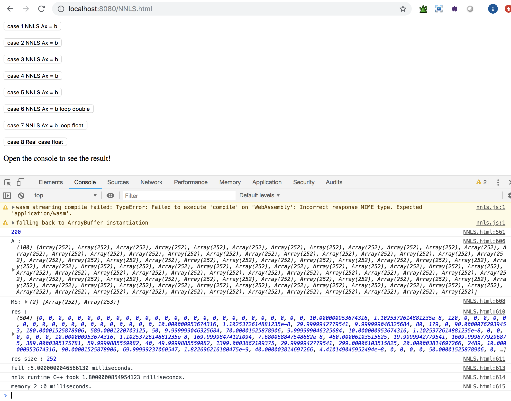

This is a wrapper of Eigen-NNLS package into webassambly javascript

original code comes from: https://github.com/hmatuschek/eigen3-nnls

## Need to have emscripten installed

## activate emb
source /Users/tgg/Github/emsdk/emsdk_env.sh --build=Release

This directory contains the C++ Eigen-NNLS for emscripten.

## how to compile nnls-wrapper.cpp for webasm/js:
if you need the modify the cpp code, you will need to recompile.

First update the path to your eigen3 installation path before to compile in the "compile.sh" file & than run this command in the terminal (in this folder):

./compile.sh

is it not working you may need to change the rigths of the the file using "chmod -x compile.sh" command ("for executable file") you will need to have admin privileges.

## examples:
I add severals examples in NNLS.html page. Run this following command in your terminal (again in this folder) 

./serve.sh

Open your browser at this url "localhost:8080/NNLS.html" & activate your brower console. 

Click on one of the examples.

Guillaume
